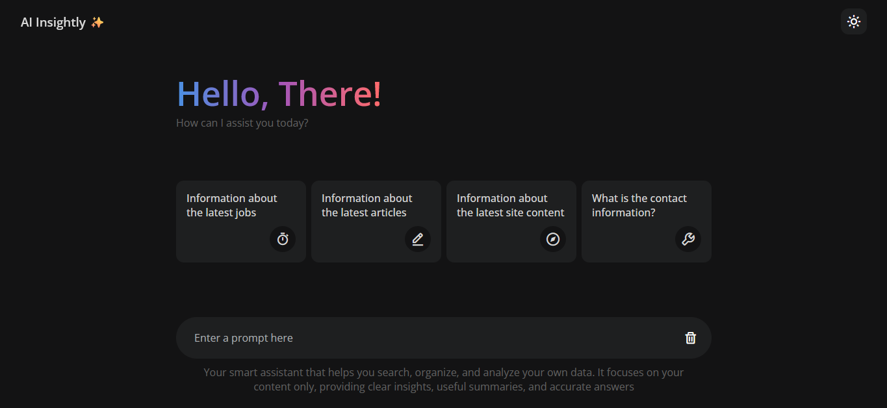

# 🤖 AI-Insightly

**AI-Insightly** — A focused web app that works like a lightweight AI assistant, but instead of searching the entire web, it explores and answers from a **specific dataset** you provide.

[](https://amdevtech.github.io/AI-Insightly/)
[](LICENSE)

---

## Summary

AI-Insightly allows you to interact with your own dataset using a simple **chat-style interface**.  
You can ask questions, explore insights, and get context-aware answers — all powered by **JavaScript** in the browser, with no backend required.

---

## Screenshot



---

## Explanation of use

1. **Upload Dataset** — load your own JSON dataset into the app.
2. **Ask Questions** — type your query in natural language.
3. **Get Insights** — the app searches and summarizes answers from your dataset.
4. **Clear Chat** — reset the session and start over.

---

## How the project is packaged

- The app is built as a **static web app** (HTML, CSS, JS).
- No backend or database is needed — everything runs in the browser.
- Dataset is provided in **JSON format** for flexibility.

---

## Usage (Quick start)

1. Clone the repository or download the project files.
2. Open `index.html` in your browser.
3. Upload your dataset (JSON).
4. Start asking questions and get instant insights.

---

## Roadmap

### ✅ Completed tasks
- Chat-style Q&A interface.
- Load and parse custom dataset (JSON).
- Instant search and summarization.
- Clear chat history.

### 🚧 Planned / To-do tasks
- Support for multiple dataset formats (CSV, XML).
- Option to connect to an external API.
- Add export of Q&A sessions as text/markdown.
- Theming and customization options.

---

## File structure

```
/ (repo root)
├─ index.html        # main HTML file
├─ script.js         # core logic
├─ style.css         # styles
├─ assets/
│  └─ screenshot01.png
└─ README.md
```

---

## Author
**Ahmed Hafez** — AI-Insightly
